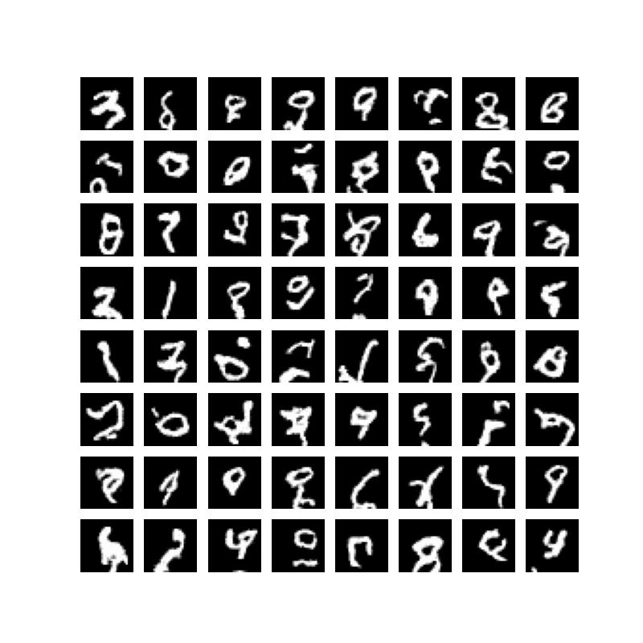

# PixelCNN
* The following is an implementation based on the paper "Pixel Recurrent Neural Networks, by Van den oord et.al"
* We have done many experiments to get the thing working, only the final details are included in this file

## Training Datset
* Only MNIST Dataset was used to test due to compute constraint. We have not reported log probabilities, it is a future work on test dataset

## Architecture Details
* 8 layers of Masked convnets
* Hidden layers have 64 features, spatial dimension is maintained at each layer
* Type A mask(defined in paper) at input data and thereafter we use Type B mask
* Activation function used Gelu
* Output Activation Softmax (256 dimensional output)
* BatchNorm of size 64 used at every intermediate layer

## Inference
* We take a zero vector of size (B,28,28)
* We autoregressively generate one pixel at a time (i+1th pixel is generated at ith run)
* Doing this proccess for 783 times generates the required image

## Psuedocode(Training)
* Take an image(MNIST)
* Flatten it to from B,28,28 to B,28*28
* We feed this to the Neural Network
* Apply the mask to weights and do forward pass
* Train using backprop with Adam optimizer, hyperparameters can be found in the code.

## Training Details
* No preproccesssing on data is
* Trained for 18 epochs on colab RAM
* Achieved avg log likelihood on training dataset

## Mask Details
* Refer to paper for more details

## Samples Generated
 
 
## Future changes/work
* Cleaning the code to make it more readable and efficient
* Trying softmax by quantization of pixel
* Scaling the method to generate color image 
* Implementing the GatedPixelCNN and Attention to increase receptive fields
* Using PixelCNN as prior on VQ-VAE
* HyperParameter Search
